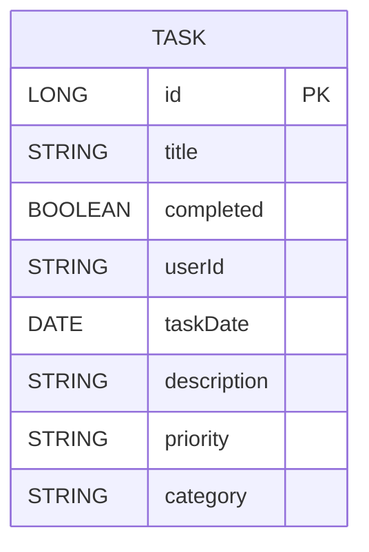

# Data Model

```mermaid
erDiagram
  TASK {
    LONG id PK
    STRING title
    BOOLEAN completed
    STRING userId
    DATE taskDate
    STRING description
    STRING priority
    STRING category
  }
```
