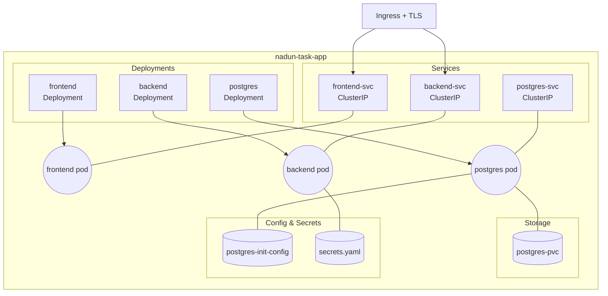

# Kubernetes Topology (Namespace: nadun-task-app)

```mermaid
flowchart TB
  subgraph Namespace[nadun-task-app]
    subgraph Deployments
      FE_DEP[frontend\nDeployment]
      BE_DEP[backend\nDeployment]
      PG_DEP[postgres\nDeployment]
    end

    subgraph Services
      FE_SVC[frontend-svc\nClusterIP]
      BE_SVC[backend-svc\nClusterIP]
      PG_SVC[postgres-svc\nClusterIP]
    end

    FE_DEP --> FE_POD((frontend pod))
    BE_DEP --> BE_POD((backend pod))
    PG_DEP --> PG_POD((postgres pod))

    FE_SVC --- FE_POD
    BE_SVC --- BE_POD
    PG_SVC --- PG_POD

    subgraph Storage
      PVC[(postgres-pvc)]
    end

    PG_POD --- PVC

    subgraph Config & Secrets
      CM[(postgres-init-config)]
      SEC[(secrets.yaml)]
    end

    PG_POD --- CM
    BE_POD --- SEC
  end

  INGRESS[Ingress + TLS] --> FE_SVC
  INGRESS --> BE_SVC
```
