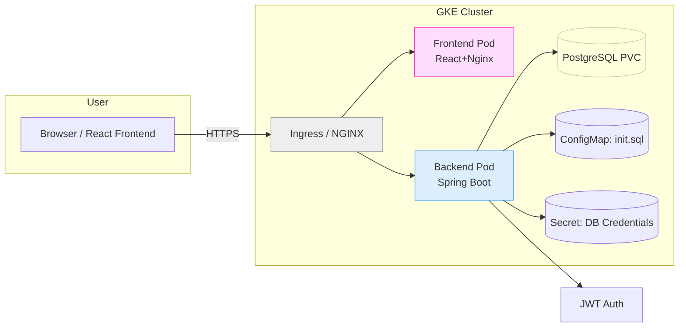

# System Architecture

```mermaid
flowchart LR
    subgraph User
      U[Browser / React Frontend]
    end

    U -->|HTTPS| ING[Ingress / NGINX]

    subgraph GKE Cluster
      ING --> FE[Frontend Pod\nReact+Nginx]
      ING --> BE[Backend Pod\nSpring Boot]
      BE --> PG[(PostgreSQL PVC)]
      BE --> CM[(ConfigMap: init.sql)]
      BE --> SEC[(Secret: DB Credentials)]
    end

    BE --> JWT[JWT Auth]
    style PG fill:#ffd,stroke:#cc9
    style BE fill:#def,stroke:#39f
    style FE fill:#fdf,stroke:#f3c
    style ING fill:#eee,stroke:#999
```
