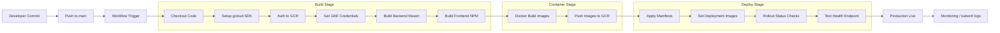

# CI/CD Pipeline (GitHub Actions)

```mermaid
flowchart LR
  %% Entry points
  DEV[Developer Commit] --> PUSH[Push to main]
  PUSH --> GHWF[Workflow Trigger]

  %% Build Stage
  subgraph BUILD[Build Stage]
    STEP1[Checkout Code]
    STEP2[Setup gcloud SDK]
    STEP3[Auth to GCR]
    STEP4[Get GKE Credentials]
    STEP5[Build Backend Maven]
    STEP6[Build Frontend NPM]
  end

  %% Image Stage
  subgraph IMAGE[Container Stage]
    STEP7[Docker Build Images]
    STEP8[Push Images to GCR]
  end

  %% Deploy Stage
  subgraph DEPLOY[Deploy Stage]
    STEP9[Apply Manifests]
    STEP10[Set Deployment Images]
    STEP11[Rollout Status Checks]
    STEP12[Test Health Endpoint]
  end

  %% Production & Monitoring
  PROD[Production Live] --> MONITOR["Monitoring / kubectl logs"]

  GHWF --> STEP1 --> STEP2 --> STEP3 --> STEP4 --> STEP5 --> STEP6 --> STEP7 --> STEP8 --> STEP9 --> STEP10 --> STEP11 --> STEP12 --> PROD
```
