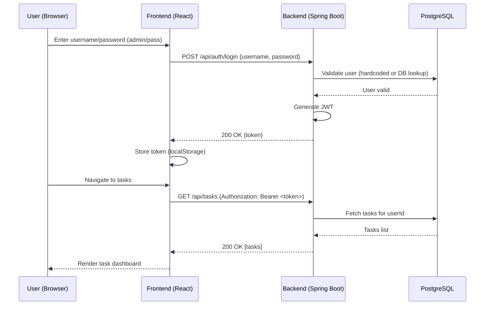

# Auth / Login Sequence

```mermaid
sequenceDiagram
  participant U as User (Browser)
  participant FE as Frontend (React)
  participant BE as Backend (Spring Boot)
  participant DB as PostgreSQL

  U->>FE: Enter username/password (admin/pass)
  FE->>BE: POST /api/auth/login {username, password}
  BE->>DB: Validate user (hardcoded or DB lookup)
  DB-->>BE: User valid
  BE->>BE: Generate JWT
  BE-->>FE: 200 OK {token}
  FE->>FE: Store token (localStorage)
  U->>FE: Navigate to tasks
  FE->>BE: GET /api/tasks (Authorization: Bearer <token>)
  BE->>DB: Fetch tasks for userId
  DB-->>BE: Tasks list
  BE-->>FE: 200 OK [tasks]
  FE-->>U: Render task dashboard
```
